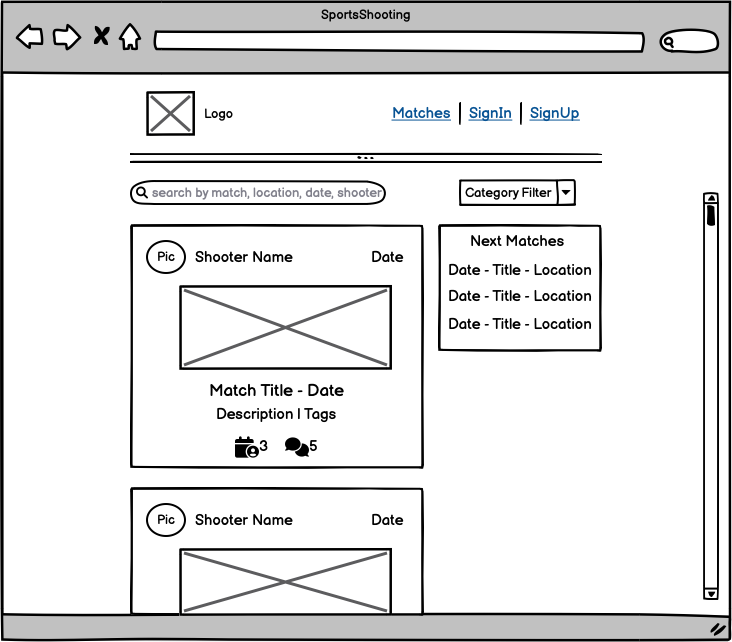
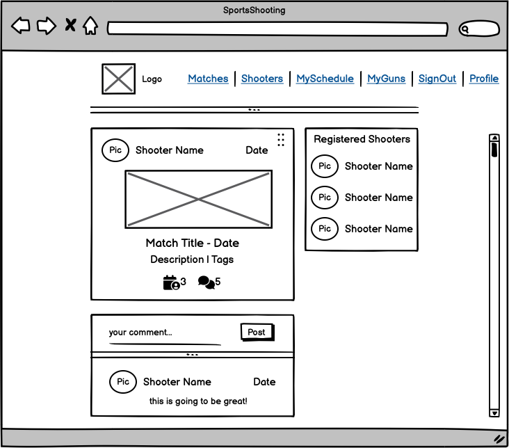
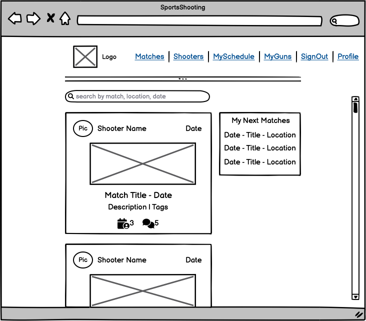
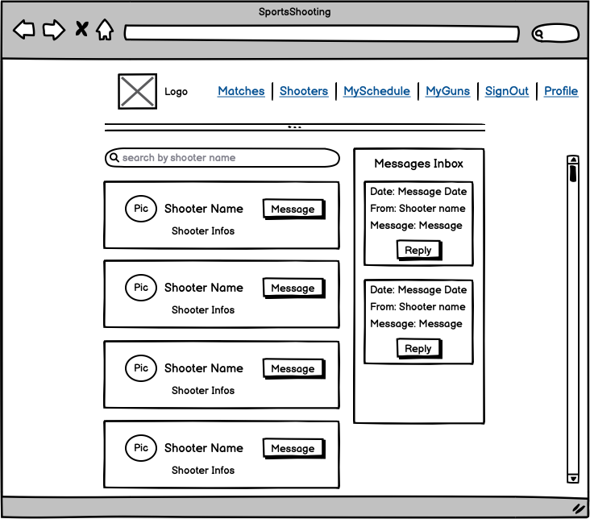
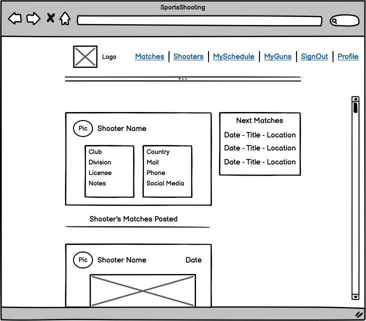

# SportsShooting - DRF API

The "SportsShooting DRF API" is a site, which acts as the API for the related React Front End project `INSERT LINK HERE`. It will provide the necessary backend and API functionality, to be consumed by the React frontend application.

---

## User Stories

### Setup and Documentation
- As a Developer I can create the README of the project so an interested user can verify my work and follow up the development process
- As a Developer I can create the TESTING part of the documentation so an interested user can verify the testing process

### Profiles

- As a Developer I can create a new user, which will automatically create a profile for this user, so I can use the features only available for registered users
- As a Developer I can list all created profiles, so I can use this information for further processing
- As a Developer I can edit my profile, so I can add further information to my profile
- As a Developer I can delete my profile and all it's linked content, so my account will be completely erased from the API - STRETCH OBJECTIVE

### Matches

- As a Developer I can create a new match so that it is visible in the matches list
- As a Developer I can view the match details so that I can see additional information as well as the comments (if there are any)
- As a Developer I can view a list of all matches so that I can use it for further processing
- As a Developer I can edit a match created by me so that I can update or correct it
- As a Developer I can delete a match created by me so it will no longer be available via the API
- As a Developer I can create a filter so I can search based on match, location, date or shooter
- As a Developer I can create a pre defined category filter so I can use it to create a type filter for level type of match

### Comment

- As a Developer I can create a comment so it will be available via the API to be used and linked to a match
- As a Developer I edit a comment created by me so I can update its data
- As a Developer I can delete a comment created by me so it will no longer be availabe via the API
- As a Developer I can list all comments so I can use it for further processing and filtering

### MySchedule / Attending - content visible to particular user

- As a Developer I can create an attending object for a match I am going so I can use it for further processing via the API
- As a Developer I can delete an attending object, which I have created so I can access / update the API with this information
- As a Developer I can view all attending objects I have created so I can use it for further processing via the API
- As a Developer I can create a filter so I can filter based on match, location, date and level type.

### MyGuns - content visible to particular user

- As a Developer I can create a new gun item so that it is visible in the MyGuns list
- As a Developer I can update a gun item so that I can correct or change its data
- As a Developer I can delete a gun item so that it will no longer exist via the API
- As a Developer I can create a pre defined category filter so I can use it to create a type filter for handgun or rifle

### Shooters / Messages - STRETCH OBJECTIVE

- As a Developer I can view / list all profiles created so I can use partial information to be seen via the API
- As a Developer I can create a message so I can see the created message via the API
- As a Developer I can update a message I have created so I can update its data via the API
- As a Developer I can delete a message I have created so it will no longer be available via the API
- As a Developer I can create a filter so that I can search based on the shooters name or club

---

## Wireframes

The Wireframes are the prototype of this project and show the base idea and the skeleton of the app. Even though this repo is mainly used for the API backend, the Wireframes of the frontend application do still have a crucial impact, since they define the data to be consumed.. I've used [Balsamiq](https://balsamiq.com/wireframes) to design my site wireframes.

Mobile Wireframe

  

Desktop Wireframe

  

---

## Data Model

The following ERD (Entity Relationship Diagram) displays the SQL database schema and the associated models, used to create this project. It shows the underlaying fundament of the individual models and their relation to it.

---

## Development

The following chapters describe why and how I have choosen to code certain parts the way they are. This section should give an explanation to my thinking process and explain the reader some conceptual decisions.

### Commit messages

I have decided to mostly use multiline commit messages. Commit messages are an essential part of the whole project and a single line commit message is just not enough to explain. After reading [this interesting article](https://cbea.ms/git-commit/), it was clear to me, that I have to use it.

I have decided to use (mostly) multiline commits, but using tags as described this [cheatsheet](https://cheatography.com/albelop/cheat-sheets/conventional-commits/) or as also described in the LMS of the Code Institute. I did use the following syntax guidline:
- **feat:** for feature which may or may not include a CSS part
- **fix:** for a bugfix
- **style:** for changes to CSS or to give style to the code itself
- **docs:** for changes related to documentation
- **refactor:** for refactored code, re-written code
- **maint:** for general maintenance

---
