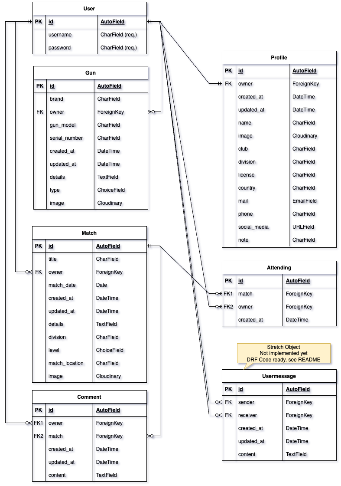
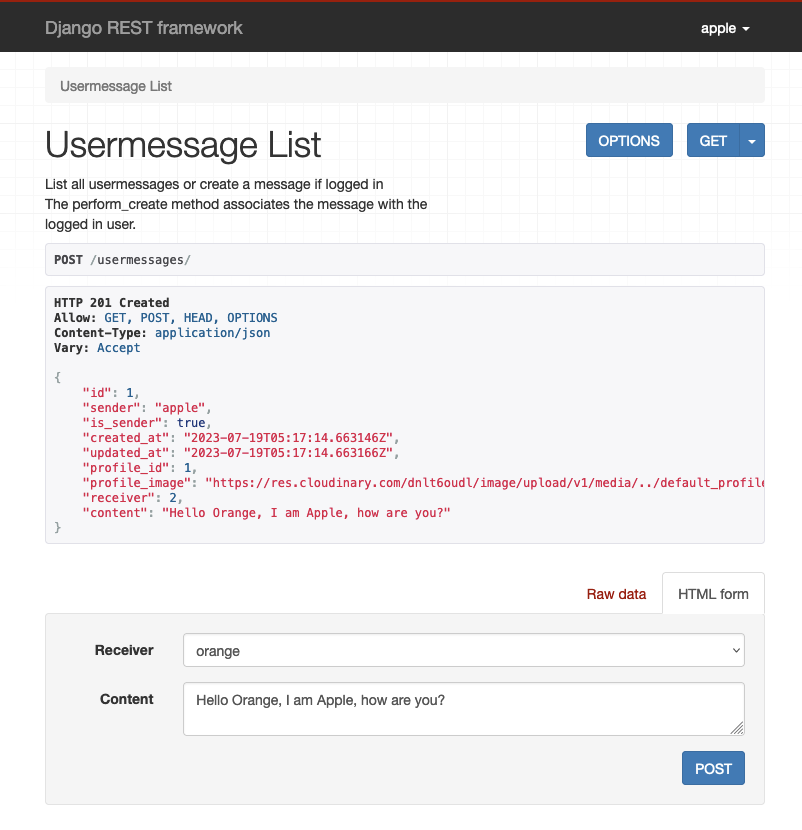
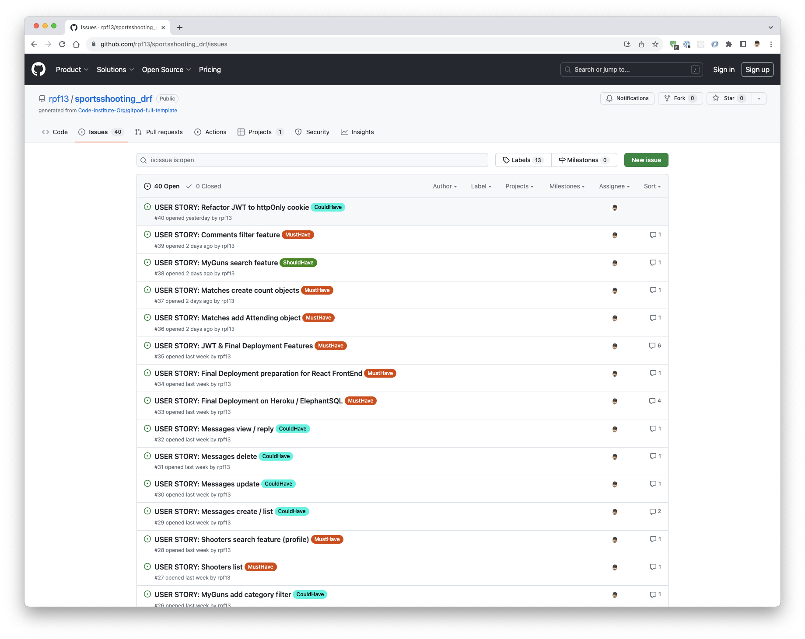

# SportsShooting - DRF API

The "SportsShooting DRF API" is a site, which acts as the API for the related React Front End project [SportsShooting](https://github.com/rpf13/sportsshooting_react). It will provide the necessary back end and API functionality, to be consumed by the React front end application.

Link to deployed DRF API site: [SportsShooting DRF API](https://sportsshooting-drf-rpf13-5060e23f8756.herokuapp.com/)

Link to deployed React Frontend site: [SportsShooting Deployed](https://sportsshooting-rpf13-d2b23798b278.herokuapp.com/)

Link to Frontend React GitHub repo: [SportsShooting Repo](https://github.com/rpf13/sportsshooting_react)

---

### Setup and Documentation
- Documentation - Create README: As a Developer I can create the README of the project so an interested user can verify my work and follow up the development process [Link](https://github.com/rpf13/sportsshooting_drf/issues/1)
- Documentation - Create TESTING file: As a Developer I can create the TESTING part of the documentation so an interested user can verify the testing process [Link](https://github.com/rpf13/sportsshooting_drf/issues/2)
- Setup -  Initial project setup: As a Developer I can create the initial DRF setup and link all necessary tools and libraries so that I can start developing the project. [Link](https://github.com/rpf13/sportsshooting_drf/issues/3)

### Profiles

- Profiles - Profile Create: As a Developer I can create a new user, which will automatically create a profile for this user, so I can use the features only available for registered users [Link](https://github.com/rpf13/sportsshooting_drf/issues/4)
- Profiles - Profile list: As a Developer I can list all created profiles, so I can use this information for further processing [Link](https://github.com/rpf13/sportsshooting_drf/issues/5)
- Profiles - Profile edit: As a Developer I can edit my profile, so I can add further information to my profile [Link](https://github.com/rpf13/sportsshooting_drf/issues/6)

### Matches

- Matches - Matches Create: As a Developer I can create a new match so that it is visible in the matches list [Link](https://github.com/rpf13/sportsshooting_drf/issues/8)
- Matches - Matches view details: As a Developer I can view the match details so that I can see additional information [Link](https://github.com/rpf13/sportsshooting_drf/issues/9)
- Matches - Matches list all: As a Developer I can view a list of all matches so that I can use it for further processing [Link](https://github.com/rpf13/sportsshooting_drf/issues/10)
- Matches - Matches edit item: As a Developer I can edit a match created by me so that I can update or correct it [Link](https://github.com/rpf13/sportsshooting_drf/issues/11)
- Matches - Matches delete item: As a Developer I can delete a match created by me so it will no longer be available via the API [Link](https://github.com/rpf13/sportsshooting_drf/issues/12)
- Matches - Matches add Attending object: As a Developer I can create count attending and count comments object including a filter option so that I can use this cumulated data in my frontend app and use the filter for it [Link](https://github.com/rpf13/sportsshooting_drf/issues/37)
- Matches - Matches search feature: As a Developer I can create a search feature so I can search based on match, location or shooter [Link](https://github.com/rpf13/sportsshooting_drf/issues/13)
- Matches - Matches category selection: As a Developer I can create a pre defined category filter so I can use it to create a type filter for level type of match [Link](https://github.com/rpf13/sportsshooting_drf/issues/14)
- Matches - Matches add Attending object: As a Developer I can add an attending object to a match object so that I can see which matches a logged in user is going to attend and have an overview, which matches are getting attended by which user [Link](https://github.com/rpf13/sportsshooting_drf/issues/36)

### MySchedule / Attending - content visible to particular user

- MySchedule - MySchedule create attending object: As a Developer I can create an attending object for a match I am going so I can use it for further processing via the API [Link](https://github.com/rpf13/sportsshooting_drf/issues/19)
- MySchedule - MySchedule delete attending object: As a Developer I can delete an attending object, which I have created so I can access / update the API with this information [Link](https://github.com/rpf13/sportsshooting_drf/issues/20)
- MySchedule - MySchedule view attending objects: As a Developer I can view all attending objects I have created so I can use it for further processing via the API [Link](https://github.com/rpf13/sportsshooting_drf/issues/21)
- MySchedule - MySchedule filter feature: As a Developer I can create a filter feature so that I can filter matches based on a particular user, so I can see for each user, which matches he will attend.
This feature will be used mainly for the MySchedule part in the react frontend. It should allow me to simply use this filter to get all matches, a user is attending. [Link](https://github.com/rpf13/sportsshooting_drf/issues/22)

### Comments

- Comments - Comment add: As a Developer I can create a comment so it will be available via the API to be used and linked to a match [Link](https://github.com/rpf13/sportsshooting_drf/issues/15)
- Comments - Comment edit: As a Developer I edit a comment created by me so I can update its data [Link](https://github.com/rpf13/sportsshooting_drf/issues/16)
- Comments - Comment delete: As a Developer I can delete a comment created by me so it will no longer be availabe via the API [Link](https://github.com/rpf13/sportsshooting_drf/issues/17)
- Comments - Comment list all: As a Developer I can list all comments so I can use it for further processing and filtering [Link](https://github.com/rpf13/sportsshooting_drf/issues/18)
- Comments - Comments filter feature: As a Developer I can add a filter feature to the comments app** so that I can see all comments added to a particular match [Link](https://github.com/rpf13/sportsshooting_drf/issues/39)


### MyGuns - content visible to particular user

- MyGuns - MyGuns create / list item: As a Developer I can create a new gun item so that it is visible in the MyGuns list [Link](https://github.com/rpf13/sportsshooting_drf/issues/23)
- MyGuns - MyGuns update item: As a Developer I can update a gun item so that I can correct or change its data [Link](https://github.com/rpf13/sportsshooting_drf/issues/24)
- MyGuns - MyGuns delete item: As a Developer I can delete a gun item so that it will no longer exist via the API [Link](https://github.com/rpf13/sportsshooting_drf/issues/25)
- MyGuns - MyGuns add category filter: As a Developer I can create a pre defined category filter so I can use it to create a type filter for handgun or rifle [Link](https://github.com/rpf13/sportsshooting_drf/issues/26)
- MyGuns - MyGuns search feature: As a Developer I can create a search feature so that I can filter based on brand, model, serial [Link](https://github.com/rpf13/sportsshooting_drf/issues/38)


### Final Deployment and React Readines

- Deployment - Final Deployment on Heroku / ElephantSQL: As a Developer I can deploy the app to Heroku and ElephantSQL so I can access the final production app to use it in my React Frontend application [Link](https://github.com/rpf13/sportsshooting_drf/issues/33)
- Deployment - Final Deployment preparation for React FrontEnd: As a Developer I can add the necessary steps required to link the React FrontEnd application to the backend so I can start developing the React app [Link](https://github.com/rpf13/sportsshooting_drf/issues/34)
- Deployment - JWT & Final Deployment Features: As a Developer I can add JWT functionality to my REST api so that I can do "base" JWT authentication with my React app [Link](https://github.com/rpf13/sportsshooting_drf/issues/35)


## Stretch User Stories

### Messages - STRETCH OBJECTIVE

- Messages - **STRETCH** Message create / list: As a Developer I can create a message to another shooter so I can see the created message via the API [Link](https://github.com/rpf13/sportsshooting_drf/issues/29)
- Messages - **STRETCH** Message update: As a Developer I can update a message I have created so I can update its data via the API [Link](https://github.com/rpf13/sportsshooting_drf/issues/30)
- Messages - **STRETCH** Message delete: As a Developer I can delete a message I have created so it will no longer be available via the API [Link](https://github.com/rpf13/sportsshooting_drf/issues/31)
- Messages - **STRETCH** Message view / reply: As a Developer I can view a message sent to me, so I can see read the content and reply to it [Link](https://github.com/rpf13/sportsshooting_drf/issues/32)

- Deployment - **STRETCH** Refactor JWT to httpOnly cookie: As a Developer I can refactor the existing JWT solution with tokens in local storage to a JWT httpOnly cookie solution** so that **my application gets more secure and JS has no longer access to the local storage tokens [Link](https://github.com/rpf13/sportsshooting_drf/issues/40)

- Profiles - **STRETCH** Profile delete: As a Developer I can delete my profile and all it's linked content, so my account will be completely erased from the API - STRETCH OBJECTIVE - Not implemented [Link](https://github.com/rpf13/sportsshooting_drf/issues/7)

---

## Data Model

The following ERD (Entity Relationship Diagram) displays the SQL database schema and the associated models, used to create this project. It shows the underlaying fundament of the individual models and their relation to it. The usermessage model is still in the ERD, even though it got removed from the project, since it did not make it to the front end. However, since I did develop the whole part in DRF, it is still in the model.



---

## API Endpoints

The following list will give a brief overview of the available API andpoints

| **URL** |
|---|
| admin/ |
| dj-rest-auth/logout/ |
| dj-rest-auth/login/ |
| dj-rest-auth/user |
| dj-rest-auth/registration/ |
| dj-rest-auth/token/refresh |
| profiles/ |
| profiles/int:pk/ |
| matches/ |
| matches/int:pk/ |
| comments/ |
| comments/int:pk/ |
| guns/ |
| guns/int:pk/ |
| attendings/ |
| attendings/int:pk/ |
| usermessages/ |
| usermessages/int:pk/ |

---

## Features

The following section describes the features of the API. The Djange REST Framework built in API browser is used to display snapshots of the individual features. This way it is more human readable to display the functionality compared to the plain json output of the API.

### Main Entry Page

The main url of the API application points to the "Welcoome" page, displaying a message to the user.


### User Profile

As part of the profiles app, or better said, as used for the profiles, there is a variety of urls provided by the dj-rest-auth package, which has been used to implemente secure authentication via JWT.
We do have the following endpoints available:
- registration: 
- login
- logout
- user
- token refresh

These endpoints are used in the front end via the repsective forms to create and manage a new user.
The followin snapshots display each of them.

<details>
<summary>JWT dj-rest url snapshots</summary>


</details>

The profile model has a 1:1 relationship to the user and it enriches the user with more data. The most obvious one is the default profile image, which gets added to the user profile. Since the user is not required to add all this additional data to his profile, all fields are optional.
The default sorting of the profiles, when sent as a list back to the front end, is the `created_at` field with the most recent first.
A search feature has been implemented via the `search_fields` in the views file. With this it is possible to search after `username` or `club` field.


Once I am logged in as a user, I have the possibility to edit / update all fields of my own profile. The custom permission class `IsOwnerOrReadOnly` has been defined and used. However, it is possible to GET the details of a specific profile with all its data even when logged out. This is important due to the way this data is consumend in the front end.


### Matches

The matches model is the primary model of the whole application, since the main usage is about creating match entries and share it. The GET is accessible for logged in and logged out users, since the data itself is no secret and should be wiedely shared. However, only a logged in user is also able to create a new entry.


The matches list section shows all sorts of data. It has an obvious relation to the user and it sets the `owner` field via the serializer, besides the `is_owner` validation flag. The serializer.
The model has three mandatory fields, which are `title`, `match_date` and `match_location`. There is also a default sorting in place to put the most recent one first.

Once the user is logged in, he can create a new match entry via filling in at least he mandatory fields. The image field is treated in the way that there is a check if the image is larger than 2MB or 4096 x 4096 pixels. This is important due to the limitation of the cloudinary free tier plan, which has been used for this project.


There is a variety of fielters / search fields in place. It is possible to search after the `username`, `title`, `match_date` as well as the `match_location`. Furthermore some `filterset_fields` have been added to filter based on the `level_filter` or on `profile`. 
Each match gets posted by default with a `level_filter` value of `Level-1`, if the user does not choose another value. This field is later used on the front end to filter based on them.


For each match entry, there is a detail view available via calling it with the PK. If the user is logged in, he has the option to alter his own created matches. The already existing data is pre populated in the form / request. This detail view, based on the `RetrieveUpdateDestroyAPIView` also lets the user delete the event, if he is the owner.
The attending object is also visible in this view, since it has a relation to the model. It is described in the upcoming chapter.


### Comments

The Comments model has a one to many relation to the user as well as the match model. It is a simple model, which only has a `content` field, besides the necessary relations to the `user` and `match`. It automatically adds a `created_at` and `updated_at` datetime field to it. The ordering is based on the `created_at` field with the most recent first.
The permission class is also set that in can only be created / edited once logged in, otherwise only the read is available.
Creating a comment only gives the option to add the content and choose the relation to the particular match - which is implemented in the front end to be done automatically since the feature is available for a particular match entry.
A filter is in place to filter all comments for a particular match.


The detail view of a comment is also available via its PK.
If a user is logged in and hence the owner of a comment, he can update or delete it. The update also returns the availabla data as pre populated data. This also allows the owner to delete a particular comment.


### Attending

The attendings model is used with a one to many relation based on teh user and the match. The main purpose is that a logged in user can attend a match and that this will create such an attending object. Please note that it is crucial that also the match event owner can attend his own match event. Only this way, a correct number of attendings are possible.
The model uses the `unique_together` setting via the Meta class, which will make sure that:
    - User A can participate in Match 1.
    - User A can also participate in Match 2.
    - User B can participate in Match 1.
But, User A cannot participate in Match 1 again because that combination already exists.

This is also further checked in the `crate` method of the serializer via the IntegrityError check.


If the detail view is accessed via it's PK, not much more data is available, however, the logged in user has the possiblility to delete his attending object, which will have a direct impact to the match model.


### MyGuns (Gun)

The gun model has a one to many relation to the user. It is only available to the logged in user and only to himself, not to any other. Therefore, to assure the security and integrity of the data to his respective owner, a custom permission class has been built. `IsOwner` is the custom permissionclass, which only allows the owner of an object to view or edit it. Alongside the django `IsAuthenticated` permission class, this is kind of a double verification to ensure the integrity.

The model only requires two mandatory fields like the `brand` and `gun_model`. The iamge field uses the same size check, as already explained in the match section.
A filterset filed is implemented in order to filter based on `handgun` or `rifle` type of gun, where s the `handgun` is the default value. There are also some search fields defined in order to search after the `brand`, `gund_model` or the `serial_number`


If the detail view is called via it's PK, it is again possible to update the object, where as the existing data gets pre populated. The deletion of the gun objct is also possible.

[Gun Detail & Delete](docs/testing/05_gun_detail_delete.png)

### Usermessages

The Usermessages got only implemented in the DRF backend. It was one of my Stretch Objectives for the back end part. Since this feature did not make it into the front end, I've decided to take it again out of the DRF code, since it may be not a good idea to have unused code in there.
Anyway, once the feature get's implemented in the front end part, it can easily be put back into the DRF section, since from a database model perspective, it has only a dependency on the user model.

The feature itself, once implemented, is only available to the registered user. A registered user can send a message to another user. The messages are only visible, if the user is logged in.



Since this part of the application is not implemented, there will be a more in depth explanation of the individual fields and parameters.

**sender**
- The `sender` field has a ForeignKey to the User model and in the serializer we define that the `user` gets its value from the `username`, which will actually be the sender of the message.
It also has a `related_name='sent_messages'` which gives the possibility once a user instance is created, to get all the sent messages of that particular user.

**receiver**
- It has also a ForeignKey to the User model and it represents the user who has received a message. Like the `sender`, it also contains a related_name but in this context called `received_messages`, 
which will help to get all the received messages of a user, once the instance is created.

**created_at / updated_at**
- These two fields get automatically added with the respective value, once a message is created

**content**
- This is the actual message field.
- Via the `Meta` class inside the model, the default sorting is set to "created_at", which would be useful for the implementation, when displaying the messages in the front end.

**Serializers** Via the serializer, some additional fields are created, which are useful for the application

**is_sender**
- The serializer gets this value using the get_is_sender method. This method checks if the currently logged in user is the same user as the sender of the message. The field will be True if the logged in user is the sender and False otherwise.

**profile_id**
- The User model has a OneToOne relationship to the Profile model and via this relation, we get the profile_id

**profile_image**
T- he `profile_image`is also derived from the Profile model, which is related to the user. Here we get the actual iamge url of the senders profile.

**usermessage**
- The `usermessage`field is part of the Detail Serializer and it will get the id of a particular message.

**Views** Regarding the views, here a brief explanation of their intention.

**UsermessageList**

- used to create and list the usermessages
- sets the permission_classes, which is a custom permission called IsSenderOrReceiver, which is kind of self explanatory
- get_queryset method is used to determine which usermessage instance should be returned from the API. Only the ones from the currently logged in user, which is sender or receiver, should be sent
- perform_create overwrite DRF generic view to set object owner to current user

**UsermessagesDetail**

- used to retrieve a single usermessage based on its primary key. It will also make sure this message can be updated or deleted
- permission class is like the one of the UsermessageList

#### Code

This section will add all the code for the usermessages app, which got removed from the DRF API, since it did not make it to the final version in the frontend.
A new app can easily be created in DRF and this code added.

<details>
<summary>models.py</summary>

```python

from django.db import models
from django.contrib.auth.models import User


class Usermessage(models.Model):
    """
    Usermessage model, related to owner / user for
    sender & receiver fields. Uses related_name
    to distinguish between the two.
    Used to create usermessages entries in DB
    """
    sender = models.ForeignKey(
        User, related_name='sent_messages', on_delete=models.CASCADE
    )
    receiver = models.ForeignKey(
        User, related_name='received_messages', on_delete=models.CASCADE
    )
    created_at = models.DateTimeField(auto_now_add=True)
    updated_at = models.DateTimeField(auto_now=True)
    content = models.TextField()

    class Meta:
        ordering = ["-created_at"]

    def __str__(self):
        return f'{self.owner} : {self.content}'

```

</details>

<details>
<summary>serializers.py</summary>

```python

from rest_framework import serializers
from .models import Usermessage


class UsermessageSerializer(serializers.ModelSerializer):
    """
    Serializer for the Usermessage model
    The currently logged in user will be used as the sender of
    the message
    """
    sender = serializers.ReadOnlyField(source='sender.username')
    is_sender = serializers.SerializerMethodField()
    profile_id = serializers.ReadOnlyField(source='sender.profile.id')
    profile_image = serializers.ReadOnlyField(
        source='sender.profile.image.url'
    )

    def get_is_sender(self, obj):
        request = self.context['request']
        return request.user == obj.sender

    class Meta:
        model = Usermessage
        fields = [
            'id', 'sender', 'is_sender', 'created_at', 'updated_at',
            'profile_id', 'profile_image', 'receiver', 'content',
        ]


class UsermessageDetailSerializer(UsermessageSerializer):
    """
    Serializer for the Usermessage model used in Detail view.
    Inherits from UsermessageSerializer.
    usermessage is a read only field so that we dont have to set
    this permission on each update
    """
    usermessage = serializers.ReadOnlyField(source='usermessage.id')

```

</details>

<details>
<summary>views.py</summary>

```python

from rest_framework import generics, permissions, filters
from django.db.models import Q
from main.permissions import IsSenderOrReadOnly, IsSenderOrReceiver
from .models import Usermessage
from .serializers import UsermessageSerializer


class UsermessageList(generics.ListCreateAPIView):
    """
    List all usermessages or create a message if logged in
    The perform_create method associates the message with the
    logged in user.
    """
    serializer_class = UsermessageSerializer
    permission_classes = [IsSenderOrReceiver]
    # queryset = Usermessage.objects.all().order_by('-created_at')

    def get_queryset(self):
        """
        return only the objects, where the current user is either sender
        or the receiver
        """
        messages = Usermessage.objects.filter(
            Q(sender=self.request.user.id) | Q(receiver=self.request.user.id)
        )
        return messages

    # overwrite DRF generic view to set object owner to current user
    def perform_create(self, serializer):
        serializer.save(sender=self.request.user)


class UsermessagesDetail(generics.RetrieveUpdateDestroyAPIView):
    """
    Retrieve, Update, Delete Usermessages object, if current user
    is the owner
    """
    serializer_class = UsermessageSerializer
    permission_classes = [IsSenderOrReadOnly]

    queryset = Usermessage.objects.order_by('-created_at')

```

</details>

<details>
<summary>urls.py</summary>

```python

from django.urls import path
from usermessages import views

urlpatterns = [
    path('usermessages/', views.UsermessageList.as_view()),
    path('usermessages/<int:pk>/', views.UsermessagesDetail.as_view()),
]

```

</details>

In the settings.py of the main app, in the parameter INSTALLED_APPS, it would have to be added via `usermessages`, besides the necessary import

</details>

The URL also needs to be added to the existing list in the main urls.py file

`path('', include('usermessages.urls')),`

---

## Features Left to Implement

The following two features were not implemented and will be a good task for the next iteration.

- Deployment - **STRETCH** Refactor JWT to httpOnly cookie: As a Developer I can refactor the existing JWT solution with tokens in local storage to a JWT httpOnly cookie solution** so that **my application gets more secure and JS has no longer access to the local storage tokens [Link](https://github.com/rpf13/sportsshooting_drf/issues/40)
- Profiles - **STRETCH** Profile delete: As a Developer I can delete my profile and all it's linked content, so my account will be completely erased from the API - STRETCH OBJECTIVE - Not implemented [Link](https://github.com/rpf13/sportsshooting_drf/issues/7)

---

## Tools & Technologies Used

I used the following technologies and resources to create this site:

- [Python](https://www.python.org) used as the back-end programming language.
- [Git](https://git-scm.com) used for version control. (`git add`, `git commit`, `git push`)
- [GitHub](https://github.com) used for secure online code storage.
- [Gitpod](https://gitpod.io) used as a cloud-based IDE for development.
- [Django REST Framework](https://www.django-rest-framework.org/) used as the REST framework for the site.
- [PostgreSQL](https://www.postgresql.org) used as the relational database management.
- [ElephantSQL](https://www.elephantsql.com) used as the Postgres database.
- [Heroku](https://www.heroku.com) used for hosting the deployed back-end site.
- [Cloudinary](https://cloudinary.com) used for dynamic file storage for all images.
- [Markdown Builder by Tim Nelson](https://traveltimn.github.io/markdown-builder) used to help generate the Markdown files.
- [Freelogodesign](https://www.freelogodesign.org) has been used to create the default images and icons used for the upload sections
- [Filtering Django REST](https://www.django-rest-framework.org/api-guide/filtering/) Article about how to implement filters
- [Django REST Testing](https://docs.djangoproject.com/en/4.2/topics/testing/tools/#testing-tools) Article about the REST testing tools

In addition to the above mentioned resources, I have used the following libraries, as specified in the requirements.txt file.

- **asgiref==3.7.2** - [ASGI server & tools](https://pypi.org/project/asgiref/3.7.2/)
- **cloudinary==1.33.0** - [Image & video management](https://pypi.org/project/cloudinary/1.33.0/)
- **dj-database-url==0.5.0** - [Database URL config](https://pypi.org/project/dj-database-url/0.5.0/)
- **dj-rest-auth==2.1.9** - [DRF authentication](https://pypi.org/project/dj-rest-auth/2.1.9/)
- **Django==3.2.20** - [Web framework](https://pypi.org/project/Django/3.2.20/)
- **django-allauth==0.44.0** - [Authentication app](https://pypi.org/project/django-allauth/0.44.0/)
- **django-cloudinary-storage==0.3.0** - [Cloudinary storage](https://pypi.org/project/django-cloudinary-storage/0.3.0/)
- **django-cors-headers==4.2.0** - [CORS headers](https://pypi.org/project/django-cors-headers/4.2.0/)
- **django-filter==23.2** - [Queryset filtering](https://pypi.org/project/django-filter/23.2/)
- **djangorestframework==3.14.0** - [REST framework](https://pypi.org/project/djangorestframework/3.14.0/)
- **djangorestframework-simplejwt==5.2.2** - [JWT for DRF](https://pypi.org/project/djangorestframework-simplejwt/5.2.2/)
- **gunicorn==21.2.0** - [WSGI HTTP server](https://pypi.org/project/gunicorn/21.2.0/)
- **oauthlib==3.2.2** - [OAuth library](https://pypi.org/project/oauthlib/3.2.2/)
- **Pillow==10.0.0** - [Image processing](https://pypi.org/project/Pillow/10.0.0/)
- **psycopg2==2.9.6** - [PostgreSQL adapter](https://pypi.org/project/psycopg2/2.9.6/)
- **PyJWT==2.8.0** - [JWT encoding/decoding](https://pypi.org/project/PyJWT/2.8.0/)
- **python3-openid==3.2.0** - [OpenID for Python 3](https://pypi.org/project/python3-openid/3.2.0/)
- **pytz==2023.3** - [Timezone utilities](https://pypi.org/project/pytz/2023.3/)
- **requests-oauthlib==1.3.1** - [OAuth for Requests](https://pypi.org/project/requests-oauthlib/1.3.1/)
- **sqlparse==0.4.4** - [SQL parsing](https://pypi.org/project/sqlparse/0.4.4/)
- **urllib3==1.26.16** - [HTTP client](https://pypi.org/project/urllib3/1.26.16/)

---

## Development

The following chapters describe why and how I have choosen to code certain parts the way they are. This section should give an explanation to my thinking process and explain the reader some conceptual decisions.

### Commit messages

I have decided to mostly use multiline commit messages. Commit messages are an essential part of the whole project and a single line commit message is just not enough to explain. After reading [this interesting article](https://cbea.ms/git-commit/), it was clear to me, that I have to use it.

I have decided to use (mostly) multiline commits, but using tags as described this [cheatsheet](https://cheatography.com/albelop/cheat-sheets/conventional-commits/) or as also described in the LMS of the Code Institute. I did use the following syntax guidline:
- **feat:** for feature which may or may not include a CSS part
- **fix:** for a bugfix
- **style:** for changes to CSS or to give style to the code itself
- **docs:** for changes related to documentation
- **refactor:** for refactored code, re-written code
- **maint:** for general maintenance

---

## Agile Development Process

I am totally convinced, that an agile development process is crucial for any project. It helped me a lot to keep focus and take the big project piece by piece. Furthermore, it really let me think at the beginning of the project on how to approach this project and which taks might be needed.

Since not everyting was clear from the beginning, especially since this is only the back end part of the project and not all details of the front end were clear at this point in time, it was partially difficult. However, while doing the front end part, I had to come back to the back end and change a few things.

### Github Projects

[Github Projects](https://github.com/users/rpf13/projects/6/views/1) has been used as the Agile tool during the development phase of this project. The Kanban board was very useful to keep track on the tasks. I have created 4 columns (ToDo, In Progress, On Hold, Done) and moved the stories accordingly. 
The On Hold column has served as a "parking spaces", when a story was partially done, but not completely finished.


### GitHub Issues

[Github Issues](https://github.com/rpf13/sportsshooting_drf/issues) has been used to create all the stories, before they were placed on the projects Kanban board. I have created an issues templates to simplify creation.
Each issue has a label for the MoSCoW prioritization.

Once a story has been created via the template, it will be automatically added to the Kanban board in the Todo column.



### MoSCoW Prioritization

The MoSCoW prioritization has been used to divide all epics and stories into the following categories:

- MustHave: guaranteed to be delivered
- ShouldHave: adds significant value, but not mandatory for MVP
- CouldHave: adds value, would be nice to have
- WontHave: no priority for this iteration, acts as placeholder for future implementation

A related Github label has been created for each category and added to each epic, story - which makes it easy to identify and see the value it brings.

---

## Testing

Testing is covered in a separate page, view [TESTING.md](TESTING.md)

---

## Deployment

The live deployed API can be found deployed on [SportsShooting DRF API](https://sportsshooting-drf-rpf13-5060e23f8756.herokuapp.com/)

### ElephantSQL Database

This project uses [ElephantSQL](https://www.elephantsql.com) for the PostgreSQL Database.

To obtain your own Postgres Database, sign-up with your GitHub account, then follow these steps:
- Click **Create New Instance** to start a new database.
- Provide a name (this is commonly the name of the project: the-collection).
- Select the **Tiny Turtle (Free)** plan.
- You can leave the **Tags** blank.
- Select the **Region** and **Data Center** closest to you.
- Once created, click on the new database name, where you can view the database URL and Password.

### Cloudinary API

This project uses the [Cloudinary API](https://cloudinary.com) to store media assets online, due to the fact that Heroku doesn't persist this type of data.

To obtain your own Cloudinary API key, create an account and log in.
- For *Primary interest*, you can choose *Programmable Media for image and video API*.
- Optional: *edit your assigned cloud name to something more memorable*.
- On your Cloudinary Dashboard, you can copy your **API Environment Variable**.
- Be sure to remove the `CLOUDINARY_URL=` as part of the API **value**; this is the **key**.

### Heroku Deployment

This project uses [Heroku](https://www.heroku.com), a platform as a service (PaaS) that enables developers to build, run, and operate applications entirely in the cloud.

Deployment steps are as follows, after account setup:

- Select **New** in the top-right corner of your Heroku Dashboard, and select **Create new app** from the dropdown menu.
- Your app name must be unique, and then choose a region closest to you (EU or USA), and finally, select **Create App**.
- From the new app **Settings**, click **Reveal Config Vars**, and set your environment variables.

| Key | Value |
| --- | --- |
| `CLOUDINARY_URL` | user's own value |
| `DATABASE_URL` | user's own value |
| `ALLOWED_HOST` | url of deployed DRF application, basically the current application |
| `SECRET_KEY` | user's own value |
| `CLIENT_ORIGIN` | url of deployed front end application, which is consuming this API |
| `CLIENT_ORIGIN_DEV` | url of development front end application, which is consuming this API |

Heroku needs two additional files in order to deploy properly.
- requirements.txt
- Procfile

You can install this project's **requirements** (where applicable) using:
- `pip3 install -r requirements.txt`

If you have your own packages that have been installed, then the requirements file needs updated using:
- `pip3 freeze --local > requirements.txt`

The **Procfile** can be created with the following command:
- `echo web: gunicorn app_name.wsgi > Procfile`
- *replace **app_name** with the name of your primary Django app name; the folder where settings.py is located*

For Heroku deployment, follow these steps to connect your own GitHub repository to the newly created app:

Either:
- Select **Automatic Deployment** from the Heroku app.

Or:
- In the Terminal/CLI, connect to Heroku using this command: `heroku login -i`
- Set the remote for Heroku: `heroku git:remote -a app_name` (replace *app_name* with your app name)
- After performing the standard Git `add`, `commit`, and `push` to GitHub, you can now type:
	- `git push heroku main`

The project should now be connected and deployed to Heroku!

### Local Deployment

This project can be cloned or forked in order to make a local copy on your own system.

For either method, you will need to install any applicable packages found within the *requirements.txt* file.
- `pip3 install -r requirements.txt`.

You will need to create a new file called `env.py` at the root-level,
and include the same environment variables listed above from the Heroku deployment steps.

Sample `env.py` file:

```python
import os

os.environ['DEV'] = '1'
os.environ["CLOUDINARY_URL"] = "user's own value"
os.environ['ALLOWED_HOST'] = "user's own value"
os.environ['DATABASE_URL'] = "user's own value"
os.environ["SECRET_KEY"] = "user's own value"

# local environment only (do not include these in production/deployment!)
os.environ.setdefault("DEBUG", "True")
```

Once the project is cloned or forked, in order to run it locally, you'll need to follow these steps:
- Start the Django app: `python3 manage.py runserver`
- Stop the app once it's loaded: `CTRL+C` or `⌘+C` (Mac)
- Make any necessary migrations: `python3 manage.py makemigrations`
- Migrate the data to the database: `python3 manage.py migrate`
- Create a superuser: `python3 manage.py createsuperuser`
- Load fixtures (if applicable): `python3 manage.py loaddata file-name.json` (repeat for each file)
- Everything should be ready now, so run the Django app again: `python3 manage.py runserver`

#### Cloning

You can clone the repository by following these steps:

1. Go to the [GitHub repository](https://github.com/rpf13/sportsshooting_drf) 
2. Locate the Code button above the list of files and click it 
3. Select if you prefer to clone using HTTPS, SSH, or GitHub CLI and click the copy button to copy the URL to your clipboard
4. Open Git Bash or Terminal
5. Change the current working directory to the one where you want the cloned directory
6. In your IDE Terminal, type the following command to clone my repository:
	- `git clone https://github.com/rpf13/sportsshooting_drf.git`
7. Press Enter to create your local clone.

Alternatively, if using Gitpod, you can click below to create your own workspace using this repository.

[](https://gitpod.io/#https://github.com/rpf13/sportsshooting_drf)

Please note that in order to directly open the project in Gitpod, you need to have the browser extension installed.
A tutorial on how to do that can be found [here](https://www.gitpod.io/docs/configure/user-settings/browser-extension).

#### Forking

By forking the GitHub Repository, we make a copy of the original repository on our GitHub account to view and/or make changes without affecting the original owner's repository.
You can fork this repository by using the following steps:

1. Log in to GitHub and locate the [GitHub Repository](https://github.com/rpf13/sportsshooting_drf)
2. At the top of the Repository (not top of page) just above the "Settings" Button on the menu, locate the "Fork" Button.
3. Once clicked, you should now have a copy of the original repository in your own GitHub account!

---

## Credits

### Code

I did quite some research for this project. Besides the tutorials lessons we had as part of the [Code Institutes](https://codeinstitute.net/global/) material, I have used the following resources:

- [DRF - Main Site](https://www.django-rest-framework.org/) Django Rest Framework's official documentation, providing a general introduction and overview.
- [Authentication](https://www.django-rest-framework.org/api-guide/authentication/) Explanation on how DRF handles user authentication.
- [Serializers](https://www.django-rest-framework.org/api-guide/serializers/) Detailed guide on defining and using serializers in DRF.
- [Generic Views](https://www.django-rest-framework.org/api-guide/generic-views/) Explanation on how DRF's generic views work and how to use them.
- [Permissions](https://www.django-rest-framework.org/api-guide/permissions/) Understanding DRF permissions and how to implement custom permission classes.
- [ViewSets & Routers](https://www.django-rest-framework.org/api-guide/viewsets/#viewset) Provides details on how to utilize ViewSets in conjunction with routers for simplifying URL configuration.
- [Pagination](https://www.django-rest-framework.org/api-guide/pagination/) Explanation on implementing and customizing pagination in DRF.
- [Filtering](https://www.django-rest-framework.org/api-guide/filtering/) A guide about how to add filtering capabilities
- [Parser classes](https://www.django-rest-framework.org/api-guide/parsers/#fileuploadparser) Details on handling file and image uploads in DRF.
- [Requests](https://www.django-rest-framework.org/api-guide/requests/) Detailed informations on DRF's Request objects.
- [Responses](https://www.django-rest-framework.org/api-guide/responses/) Information on constructing DRF Response objects.
- [Very Academy Youtube Channel](https://www.youtube.com/watch?v=CkQrroDkA98&list=PLOLrQ9Pn6cawHF2lVl9goEm9Ta3rlutPD) I have watched many of the Very Academy's Youtube channel, he is such a great resource

### Testing Code

For the testing part, I have used the following additional resources:

- [Django's APITestCase](https://www.django-rest-framework.org/api-guide/testing/#api-test-case) Used for testing DRF APIs with a built-in client.
- [User Model](https://docs.djangoproject.com/en/stable/ref/contrib/auth/#user) Django's built-in model for authentication and authorization.
- [HTTP Status Codes](https://www.django-rest-framework.org/api-guide/status-codes/) Constants like `status.HTTP_201_CREATED` for readable tests.
- [Client.login](https://docs.djangoproject.com/en/stable/topics/testing/tools/#django.test.Client.login) Method to log a user in for authenticated requests.
- [Refresh from Database](https://docs.djangoproject.com/en/stable/ref/models/instances/#django.db.models.Model.refresh_from_db) Reloads an object from the database for the current state.
- [Django URLs](https://docs.djangoproject.com/en/stable/topics/http/urls/) URL routing to access endpoints within tests
- Creating and Deleting Objects](https://docs.djangoproject.com/en/stable/topics/db/queries/) Using the Django ORM for test setup and teardown.
- [Assertion Methods](https://docs.djangoproject.com/en/stable/topics/testing/tools/#assertions) Methods like `assertEqual` for validating tests.
- [Using `setUp` Method](https://docs.djangoproject.com/en/stable/topics/testing/tools/#django.test.TestCase.setUp) Sets up the initial state for tests, executed before each test method.
- [Custom Permissions](https://www.django-rest-framework.org/api-guide/permissions/) Ensuring users can only access their data
- [io.BytesIO](https://docs.python.org/3/library/io.html#io.BytesIO) An in-memory binary stream class from the `io` module.
- [PIL's Image.new method](https://pillow.readthedocs.io/en/stable/reference/Image.html#PIL.Image.new) A method from the Python Imaging Library (often known as Pillow) to create a new image.
- [SimpleUploadedFile](https://docs.djangoproject.com/en/stable/topics/testing/tools/#django.core.files.uploadedfile.SimpleUploadedFile) A class from Django that provides a way to create an in-memory file object. This is useful for testing uploads without actually writing to the file system.

---

### Acknowledgements

- Without the support of my wife and my little son, it would not have been possible to spend endless hours, working on this project and doing research. Many thanks to my little son for giving me a smile and very welcomed distraction, during times I was frustrated.
- My Mentor Aleksei Knovalov was a big support for this project. He helped me to understand certain concepts and gave me very welcomed guidance. THANK YOU VERY MUCH! You are such a great perons and very skilled developer!
- A big Thank you to the tutor team from Code Institute team, who has helped me with a few very nasty issues in the project
- A big thank you also goes to the awesome Code Institute Slack community, who was always very supportive!

