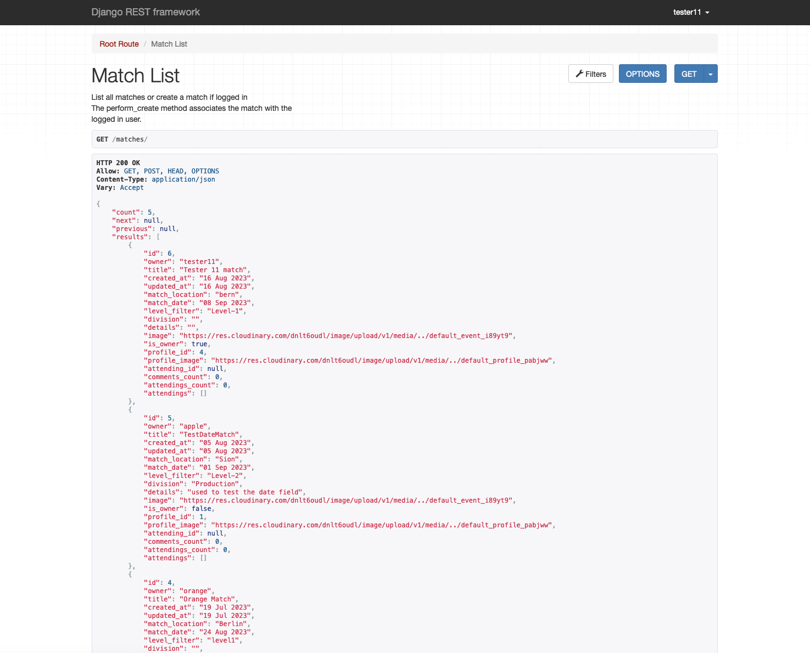
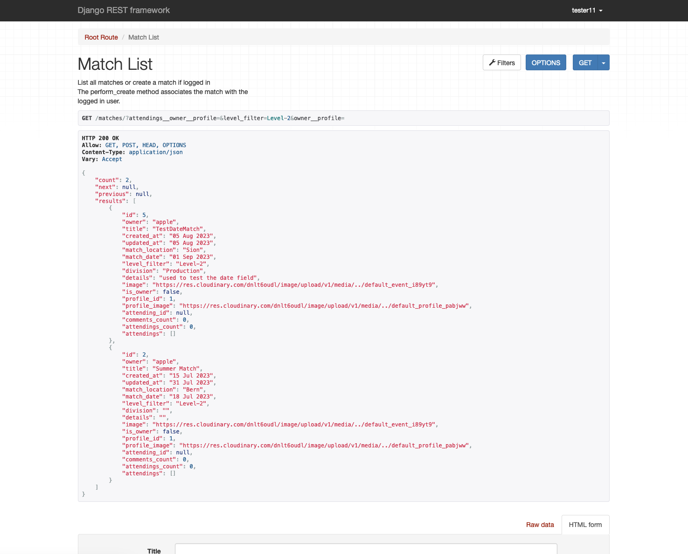

# Testing

Return back to the [README.md](README.md) file.

## Code Validation Python

I have used the recommended [CI Python Linter](https://pep8ci.herokuapp.com) to validate all of my Python files.

CI Python Linter Validation Table with Snapshots

| File | CI URL | Screenshot | Notes |
| --- | --- | --- | --- |
| attendings/apps.py | [CI PEP8](https://pep8ci.herokuapp.com/https://raw.githubusercontent.com/rpf13/sportsshooting_drf/main/attendings/apps.py) |  | Pass: No Errors |
| attendings/models.py | [CI PEP8](https://pep8ci.herokuapp.com/https://raw.githubusercontent.com/rpf13/sportsshooting_drf/main/attendings/models.py) |  | Pass: No Errors |
| attendings/serializers.py | [CI PEP8](https://pep8ci.herokuapp.com/https://raw.githubusercontent.com/rpf13/sportsshooting_drf/main/attendings/serializers.py) |  | Pass: No Errors |
| attendings/urls.py | [CI PEP8](https://pep8ci.herokuapp.com/https://raw.githubusercontent.com/rpf13/sportsshooting_drf/main/attendings/urls.py) |  | Pass: No Errors |
| attendings/views.py | [CI PEP8](https://pep8ci.herokuapp.com/https://raw.githubusercontent.com/rpf13/sportsshooting_drf/main/attendings/views.py) |  | Pass: No Errors |
| comments/apps.py | [CI PEP8](https://pep8ci.herokuapp.com/https://raw.githubusercontent.com/rpf13/sportsshooting_drf/main/comments/apps.py) |  | Pass: No Errors |
| comments/models.py | [CI PEP8](https://pep8ci.herokuapp.com/https://raw.githubusercontent.com/rpf13/sportsshooting_drf/main/comments/models.py) |  | Pass: No Errors |
| comments/serializers.py | [CI PEP8](https://pep8ci.herokuapp.com/https://raw.githubusercontent.com/rpf13/sportsshooting_drf/main/comments/serializers.py) |  | Pass: No Errors |
| comments/urls.py | [CI PEP8](https://pep8ci.herokuapp.com/https://raw.githubusercontent.com/rpf13/sportsshooting_drf/main/comments/urls.py) |  | Pass: No Errors |
| comments/views.py | [CI PEP8](https://pep8ci.herokuapp.com/https://raw.githubusercontent.com/rpf13/sportsshooting_drf/main/comments/views.py) |  | Pass: No Errors |
| guns/apps.py | [CI PEP8](https://pep8ci.herokuapp.com/https://raw.githubusercontent.com/rpf13/sportsshooting_drf/main/guns/apps.py) |  | Pass: No Errors |
| guns/models.py | [CI PEP8](https://pep8ci.herokuapp.com/https://raw.githubusercontent.com/rpf13/sportsshooting_drf/main/guns/models.py) |  | Pass: No Errors |
| guns/serializers.py | [CI PEP8](https://pep8ci.herokuapp.com/https://raw.githubusercontent.com/rpf13/sportsshooting_drf/main/guns/serializers.py) |  | Pass: No Errors |
| guns/tests.py | [CI PEP8](https://pep8ci.herokuapp.com/https://raw.githubusercontent.com/rpf13/sportsshooting_drf/main/guns/tests.py) |  | Pass: No Errors |
| guns/urls.py | [CI PEP8](https://pep8ci.herokuapp.com/https://raw.githubusercontent.com/rpf13/sportsshooting_drf/main/guns/urls.py) |  | Pass: No Errors |
| guns/views.py | [CI PEP8](https://pep8ci.herokuapp.com/https://raw.githubusercontent.com/rpf13/sportsshooting_drf/main/guns/views.py) |  | Pass: No Errors |
| main/permissions.py | [CI PEP8](https://pep8ci.herokuapp.com/https://raw.githubusercontent.com/rpf13/sportsshooting_drf/main/main/permissions.py) |  | Pass: No Errors |
| main/serializers.py | [CI PEP8](https://pep8ci.herokuapp.com/https://raw.githubusercontent.com/rpf13/sportsshooting_drf/main/main/serializers.py) |  | Pass: No Errors |
| main/settings.py | [CI PEP8](https://pep8ci.herokuapp.com/https://raw.githubusercontent.com/rpf13/sportsshooting_drf/main/main/settings.py) |  | Pass: No Errors |
| main/urls.py | [CI PEP8](https://pep8ci.herokuapp.com/https://raw.githubusercontent.com/rpf13/sportsshooting_drf/main/main/urls.py) |  | Pass: No Errors |
| main/views.py | [CI PEP8](https://pep8ci.herokuapp.com/https://raw.githubusercontent.com/rpf13/sportsshooting_drf/main/main/views.py) |  | Pass: No Errors |
| matches/models.py | [CI PEP8](https://pep8ci.herokuapp.com/https://raw.githubusercontent.com/rpf13/sportsshooting_drf/main/matches/models.py) |  | Pass: No Errors |
| matches/serializers.py | [CI PEP8](https://pep8ci.herokuapp.com/https://raw.githubusercontent.com/rpf13/sportsshooting_drf/main/matches/serializers.py) |  | Pass: No Errors |
| matches/tests.py | [CI PEP8](https://pep8ci.herokuapp.com/https://raw.githubusercontent.com/rpf13/sportsshooting_drf/main/matches/tests.py) |  | Pass: No Errors |
| matches/urls.py | [CI PEP8](https://pep8ci.herokuapp.com/https://raw.githubusercontent.com/rpf13/sportsshooting_drf/main/matches/urls.py) |  | Pass: No Errors |
| matches/views.py | [CI PEP8](https://pep8ci.herokuapp.com/https://raw.githubusercontent.com/rpf13/sportsshooting_drf/main/matches/views.py) |  | Pass: No Errors |
| profiles/models.py | [CI PEP8](https://pep8ci.herokuapp.com/https://raw.githubusercontent.com/rpf13/sportsshooting_drf/main/profiles/models.py) |  | Pass: No Errors |
| profiles/serializers.py | [CI PEP8](https://pep8ci.herokuapp.com/https://raw.githubusercontent.com/rpf13/sportsshooting_drf/main/profiles/serializers.py) |  | Pass: No Errors |
| profiles/urls.py | [CI PEP8](https://pep8ci.herokuapp.com/https://raw.githubusercontent.com/rpf13/sportsshooting_drf/main/profiles/urls.py) |  | Pass: No Errors |
| profiles/views.py | [CI PEP8](https://pep8ci.herokuapp.com/https://raw.githubusercontent.com/rpf13/sportsshooting_drf/main/profiles/views.py) |  | Pass: No Errors |

---

## User Story Testing | Manual Testing

I have tested the functional user stories and listed in the following table, together with a screenshot. Since I did also add user stories for admin tasks like deployment, documentation, ... I did not include them in the table - since snapshots are difficult for those. However, they are also clearly documented in the README section.

In the user stories, I did use the expression "As a Developer..." but this can be interchangeably used with "As a User..."
While testing the user stories, I did also test some defensive programming topics, since it makes sense to combine them. It is always mentioned in the comments section. However, most of the defensive programming will be tested via the front end.

User story testing Table with Snapshots

| User Story | Screenshot | Comment |
| --- | --- | --- |
| Profile Create: As a Developer I can create a new user, which will automatically create a profile for this user, so I can use the features only available for registered users [Link](https://github.com/rpf13/sportsshooting_drf/issues/4) |   | user created, which creates a profile |
| Profile list: As a Developer I can list all created profiles, so I can use this information for further processing [Link](https://github.com/rpf13/sportsshooting_drf/issues/5) |    | unauth user can list profile |
| Profile edit: As a Developer I can edit my profile, so I can add further information to my profile [Link](https://github.com/rpf13/sportsshooting_drf/issues/6) |     | unauth user cannot edit, auth can only edit his profile |
| Matches Create: As a Developer I can create a new match so that it is visible in the matches list [Link](https://github.com/rpf13/sportsshooting_drf/issues/8) |   | unauth user cannot create match, no form visible. Auth user can create, mandatory fileds need to be filled in |
| Matches view details: As a Developer I can view the match details so that I can see additional information [Link](https://github.com/rpf13/sportsshooting_drf/issues/9) |   | view is also avialable for unauth user |
| Matches list all: As a Developer I can view a list of all matches so that I can use it for further processing [Link](https://github.com/rpf13/sportsshooting_drf/issues/10) |  | as shown with previous snapshots, unauth user can also view list |
| Matches edit item: As a Developer I can edit a match created by me so that I can update or correct it [Link](https://github.com/rpf13/sportsshooting_drf/issues/11) |    | as shown in previous snapshot, unauth user cannot edit |
| Matches delete item: As a Developer I can delete a match created by me so it will no longer be available via the API [Link](https://github.com/rpf13/sportsshooting_drf/issues/12) |  | |
| Matches add Attending object: As a Developer I can create count attending and count comments object including a filter option so that I can use this cumulated data in my frontend app and use the filter for it [Link](https://github.com/rpf13/sportsshooting_drf/issues/37) |   | |
| Matches search feature: As a Developer I can create a search feature so I can search based on match, location or shooter [Link](https://github.com/rpf13/sportsshooting_drf/issues/13) |  | |
| Matches category selection: As a Developer I can create a pre defined category filter so I can use it to create a type filter for level type of match [Link](https://github.com/rpf13/sportsshooting_drf/issues/14) |  | default category level addition shown in previous snapshots, when creating match, which is Level-1 |
| Matches add Attending object: As a Developer I can add an attending object to a match object so that I can see which matches a logged in user is going to attend and have an overview, which matches are getting attended by which user [Link](https://github.com/rpf13/sportsshooting_drf/issues/36) |      | user cannot attend same match twice, error is shown. User can delete his attending object |
| MySchedule create attending object: As a Developer I can create an attending object for a match I am going so I can use it for further processing via the API [Link](https://github.com/rpf13/sportsshooting_drf/issues/19) |  | MySchedule does not use a dedicated API, it will more consume content from existing API in the front end |
| MySchedule delete attending object: As a Developer I can delete an attending object, which I have created so I can access / update the API with this information [Link](https://github.com/rpf13/sportsshooting_drf/issues/20) |  | |
| MySchedule view attending objects: As a Developer I can view all attending objects I have created so I can use it for further processing via the API [Link](https://github.com/rpf13/sportsshooting_drf/issues/21) |  | |
| MySchedule filter feature: As a Developer I can create a filter feature so that I can filter matches based on a particular user, so I can see for each user, which matches he will attend [Link](https://github.com/rpf13/sportsshooting_drf/issues/22) |  | |
| Comment add: As a Developer I can create a comment so it will be available via the API to be used and linked to a match [Link](https://github.com/rpf13/sportsshooting_drf/issues/15) |   | User can also list all comments |
| Comment edit: As a Developer I edit a comment created by me so I can update its data [Link](https://github.com/rpf13/sportsshooting_drf/issues/16) |   | User cannot update comment of other users |
| Comment delete: As a Developer I can delete a comment created by me so it will no longer be availabe via the API [Link](https://github.com/rpf13/sportsshooting_drf/issues/17) |  | |
| Comment list all: As a Developer I can list all comments so I can use it for further processing and filtering [Link](https://github.com/rpf13/sportsshooting_drf/issues/18) |   | Unauth User can also list all comments |
| Comments filter feature: As a Developer I can add a filter feature to the comments app** so that I can see all comments added to a particular match [Link](https://github.com/rpf13/sportsshooting_drf/issues/39) |  | |
| MyGuns create / list item: As a Developer I can create a new gun item so that it is visible in the MyGuns list [Link](https://github.com/rpf13/sportsshooting_drf/issues/23) |     | Unauth user cannot access this url. Invalid form prompts with error |
| MyGuns update item: As a Developer I can update a gun item so that I can correct or change its data [Link](https://github.com/rpf13/sportsshooting_drf/issues/24) |   | |
| MyGuns delete item: As a Developer I can delete a gun item so that it will no longer exist via the API [Link](https://github.com/rpf13/sportsshooting_drf/issues/25) |  | |
| MyGuns add category filter: As a Developer I can create a pre defined category filter so I can use it to create a type filter for handgun or rifle [Link](https://github.com/rpf13/sportsshooting_drf/issues/26) |  | |
| MyGuns search feature: As a Developer I can create a search feature so that I can filter based on brand, model, serial [Link](https://github.com/rpf13/sportsshooting_drf/issues/38) |  | |

---

## Automated Testing

I have conducted a series of automated tests on my application.

I have tested the "Matches" and the "Guns" app via unit test.
- [Matches Unit Testing](/matches/tests.py)
- [Guns Unit Testing](/guns/tests.py)

I fully acknowledge and understand that, in a real-world scenario, an extensive set of additional tests would be more comprehensive. However, I wanted to include a few example tests for CRUD functionality and permissions.

### Python (Unit Testing)

I have used Django's built-in unit testing framework to test the application functionality.

In order to run the tests, I ran the following command in the terminal each time:

`python3 manage.py test`

All testcases are successfully executed:

The following table shows a summary of testcases executed. The Guns and the Matches app got tested via the automated unit testing.

| Class | Function | Description | Comment |
| --- | --- | --- | --- |
| GunCreateTests |  |  |  |
|  | setUp | create testcredentials | base testdata to be used in test |
|  | test_create_gun | create gun object with the 2 mandatory fields |   |
|  | test_create_gun_with_large_image | create gun object with too large image |  |
| GunRetrieveTests |   |   |   |
|  | setUp | create testcredentials | base testdata to be used in test |
|  | test_retrieve_gun | test if we can get the data and assess on brand  |   |
|  | test_unauthenticated_user_cannot_retrieve | test if the unauth user cannot retrieve data | unauth user should not have access at all |
| unUpdateTests |   |   |   |
|  | setUp | create testcredentials | base testdata to be used in test |
|  | test_update_gun | check if update of brand and gun_model field is successful |  |
| GunDeleteTests |  |  |  |
|  | setUp | create testcredentials | base testdata to be used in test |
|  | test_delete_gun | test if deletion of object works | since only an auth and owner can access data, no further x-check is required |
| MatchCreateTests |  |  |  |
|  | setUp | create testcredentials | base testdata to be used in test |
|  | test_create_match | check match creation and assess based on match title |  |
|  | test_create_match_without_mandatory_fields | check if we get a 400 error when mandatory fields for match creation are not set |  |
| MatchRetrieveTests |  |  |  |
|  | setUp | create testcredentials | base testdata to be used in test |
|  | test_retrieve_match | check if we can get match by PK and assess title and match_date | this is a double check since the match_date gets adjusted in back end, therefore the value format is different thant it was when created |
| MatchUpdateTests |  |  |  |
|  | setUp | create testcredentials | base testdata to be used in test |
|  | test_update_match | check if match title can be updated |  |
| MatchUpdatePermissionTests |  |  |  |
|  | setUp | create testcredentials | base testdata to be used in test |
|  | test_update_other_users_match | verify if user-a cannot update user-b's match |  |
| MatchDeleteTests |  |  |  |
|  | setUp | create testcredentials | base testdata to be used in test |
|  | est_delete_match | the owner of the match must be able to delete the object | assess checks for 204 error to see if it is not existing after deletion |

---

## Bugs

### GitHub **Issues**

I did use GitHub Issues to track all my work, as already explained in the Agile Development section of the README. Below a snapshot with an excerpt:

The intention was to also track the bugs with github issus via adding a `bug`, opening them as stories and add them to the kanban board.
Since I did start from the beginning to deploy my project to Heroku, I did continuously verify the state of the application. Furthermore, each feature was locally tested, before / just after commit. Therefore I could fix most of the issues during the development phase. I did not open bugs when discovering an issue while being still on the development face of that particular feature.

**Fixed Bugs**

As previously mentioned, I did only start "counting" bugs when doing the testing of the front and back end application, hence the development process was finished. Since I did heavy testing during development, I could find potential issues already then. Therefore the list with bugs, found during the finalt testing round, is empty.

| Bug | Status |
| --- | --- |
|  |  |

**Open Issues**

When writing / submitting my project for assessment, there were no open issues, bugs I am aware of. However, the epic with the stretch items / future features is still in the open state. Such epics, stories got the `WontHave` tag during MoSCoW priorisation. 
Any remaining open issues can be tracked [here](https://github.com/rpf13/sportsshooting_drf/issues).

## Unfixed Bugs

There are no remaining bugs that I am aware of.

---
